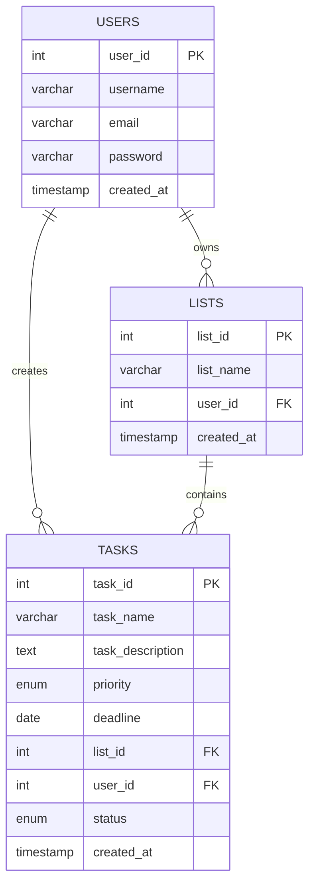

# 🎯 OrganizeHub

<div align="center">


LIVE-DEMO - https://organizehub.byethost32.com

**A Modern Task Management System Built with PHP**

[](https://php.net)
[](https://mysql.com)
[](https://getbootstrap.com)
[](LICENSE)

</div>

## 📋 Table of Contents

- [Overview](#-overview)
- [Features](#-features)
- [Screenshots](#-screenshots)
- [Installation](#-installation)
- [Configuration](#-configuration)
- [Usage](#-usage)
- [Project Structure](#-project-structure)
- [API Documentation](#-api-documentation)
- [Contributing](#-contributing)
- [Troubleshooting](#-troubleshooting)
- [License](#-license)
- [Support](#-support)

## 🌟 Overview

OrganizeHub is a comprehensive task management system designed to help individuals and teams organize their work efficiently. Built with modern PHP and featuring a sleek, responsive interface, it provides all the tools needed to manage tasks, deadlines, and priorities effectively.

### Why OrganizeHub?

- ✨ **Modern UI/UX** - Clean, intuitive interface with smooth animations
- 🚀 **Fast & Responsive** - Optimized for all devices and screen sizes
- 🔒 **Secure** - Built with security best practices and input validation
- 📊 **Organized** - Categorize tasks into custom lists and priorities
- 🎨 **Customizable** - Easy to theme and extend functionality

## ✨ Features

### 🎯 Core Features
- **Task Management**
  - Create, edit, and delete tasks
  - Set priorities (High, Medium, Low)
  - Add deadlines and descriptions
  - Organize tasks into custom lists

- **User Management**
  - Secure user authentication
  - Session management
  - User registration and login

- **Dashboard**
  - Overview of all tasks
  - Filter by categories/lists
  - Priority-based color coding
  - Responsive design

### 🎨 UI/UX Features
- **Modern Design**
  - Gradient backgrounds
  - Smooth animations and transitions
  - Hover effects and micro-interactions
  - Mobile-first responsive design

- **Enhanced Navigation**
  - Collapsible sidebar menu
  - Breadcrumb navigation
  - Quick action buttons

### 🔧 Technical Features
- **Security**
  - SQL injection prevention
  - XSS protection
  - Session management
  - Input validation and sanitization

- **Performance**
  - Optimized database queries
  - Efficient CSS and JavaScript
  - Fast loading times


## 🚀 Installation

### Prerequisites

Before installing OrganizeHub, ensure you have:

- **PHP 7.4 or higher**
- **MySQL 5.7 or higher**
- **Apache/Nginx web server**
- **Composer** (optional, for dependencies)

### Step-by-Step Installation

1. **Clone the Repository**
   ```bash
   git clone https://github.com/03musab/organizehub.git
   cd organizehub
   ```

2. **Set Up Database**
   ```sql
   -- Create database
   CREATE DATABASE organizehub_db;
   
   -- Create users table
   CREATE TABLE tbl_users (
       user_id INT AUTO_INCREMENT PRIMARY KEY,
       username VARCHAR(100) NOT NULL UNIQUE,
       email VARCHAR(150) NOT NULL UNIQUE,
       password VARCHAR(255) NOT NULL,
       created_at TIMESTAMP DEFAULT CURRENT_TIMESTAMP
   );
   
   -- Create lists table
   CREATE TABLE tbl_lists (
       list_id INT AUTO_INCREMENT PRIMARY KEY,
       list_name VARCHAR(100) NOT NULL,
       user_id INT,
       created_at TIMESTAMP DEFAULT CURRENT_TIMESTAMP,
       FOREIGN KEY (user_id) REFERENCES tbl_users(user_id) ON DELETE CASCADE
   );
   
   -- Create tasks table
   CREATE TABLE tbl_tasks (
       task_id INT AUTO_INCREMENT PRIMARY KEY,
       task_name VARCHAR(200) NOT NULL,
       task_description TEXT,
       priority ENUM('Low', 'Medium', 'High') DEFAULT 'Medium',
       deadline DATE,
       list_id INT,
       user_id INT,
       status ENUM('Pending', 'In Progress', 'Completed') DEFAULT 'Pending',
       created_at TIMESTAMP DEFAULT CURRENT_TIMESTAMP,
       FOREIGN KEY (list_id) REFERENCES tbl_lists(list_id) ON DELETE SET NULL,
       FOREIGN KEY (user_id) REFERENCES tbl_users(user_id) ON DELETE CASCADE
   );
   ```

3. **Configure Database Connection**
   ```php
   // config/constants.php
   <?php
   define('LOCALHOST', 'localhost');
   define('DB_USERNAME', 'your_username');
   define('DB_PASSWORD', 'your_password');
   define('DB_NAME', 'organizehub_db');
   define('SITEURL', 'http://localhost/organizehub/');
   ?>
   ```

4. **Set Up Web Server**
   - Copy files to your web server directory
   - Ensure proper permissions are set
   - Configure virtual host (optional)

5. **Test Installation**
   - Navigate to `http://localhost/organizehub/`
   - Register a new account
   - Start managing your tasks!

## ⚙️ Configuration

### Environment Configuration

Create a `.env` file in the root directory:

```env
# Database Configuration
DB_HOST=localhost
DB_NAME=organizehub_db
DB_USER=your_username
DB_PASS=your_password

# Application Configuration
APP_URL=http://localhost/organizehub/
APP_DEBUG=true
APP_TIMEZONE=UTC

# Security
SESSION_LIFETIME=7200
CSRF_PROTECTION=true
```

### Advanced Configuration

```php
// config/app.php
<?php
return [
    'app_name' => 'OrganizeHub',
    'version' => '1.0.0',
    'timezone' => 'UTC',
    'date_format' => 'Y-m-d',
    'items_per_page' => 10,
    'max_file_size' => '5MB',
    'allowed_extensions' => ['jpg', 'jpeg', 'png', 'pdf']
];
?>
```

## 📖 Usage

### Getting Started

1. **Register/Login**
   - Create a new account or login with existing credentials
   - Secure session management keeps you logged in

2. **Create Task Lists**
   - Organize tasks into categories
   - Create lists like "Work", "Personal", "Shopping"

3. **Add Tasks**
   - Click "Add Task" button
   - Fill in task details, priority, and deadline
   - Assign to a specific list

4. **Manage Tasks**
   - View all tasks in the dashboard
   - Edit task details anytime
   - Mark tasks as complete
   - Delete unnecessary tasks

### Advanced Features

#### Task Filtering
```php
// Filter tasks by priority
SELECT * FROM tbl_tasks WHERE priority = 'High' AND user_id = ?;

// Filter tasks by deadline
SELECT * FROM tbl_tasks WHERE deadline <= CURDATE() AND user_id = ?;
```

#### Custom Lists
- Create unlimited task categories
- Assign different colors to lists
- Filter dashboard by specific lists

## 📁 Project Structure

```
organizehub/
├── 📁 config/
│   ├── constants.php          # Database configuration
│   └── app.php               # Application settings
├── 📁 assets/
│   ├── 📁 css/
│   │   └── style.css         # Custom styles
│   ├── 📁 js/
│   │   └── app.js           # JavaScript functionality
│   └── 📁 images/
│       └── logo.png         # Application logo
├── 📁 includes/
│   ├── header.php           # Common header
│   ├── footer.php           # Common footer
│   └── functions.php        # Helper functions
├── 📁 pages/
│   ├── dashboard.php        # Main dashboard
│   ├── add-task.php         # Add new task
│   ├── edit-task.php        # Edit existing task
│   ├── delete-task.php      # Delete task
│   └── profile.php          # User profile
├── 📁 auth/
│   ├── login.php            # User login
│   ├── register.php         # User registration
│   └── logout.php           # User logout
├── 📁 sql/
│   └── database.sql         # Database schema
├── index.php                # Entry point
├── taskmanager.php          # Main task manager
├── README.md                # This file
└── .htaccess               # Apache configuration
```

## 🔧 API Documentation

### Authentication Endpoints

```php
// Login
POST /auth/login.php
{
    "username": "user@example.com",
    "password": "password123"
}

// Register
POST /auth/register.php
{
    "username": "newuser",
    "email": "user@example.com",
    "password": "password123"
}
```

### Task Management Endpoints

```php
// Get all tasks
GET /api/tasks.php?user_id={user_id}

// Create task
POST /api/tasks.php
{
    "task_name": "Complete project",
    "priority": "High",
    "deadline": "2024-12-31",
    "list_id": 1
}

// Update task
PUT /api/tasks.php?task_id={task_id}
{
    "task_name": "Updated task name",
    "priority": "Medium"
}

// Delete task
DELETE /api/tasks.php?task_id={task_id}
```

## 🤝 Contributing

We welcome contributions to OrganizeHub! Here's how you can help:

### Development Setup

1. **Fork the repository**
2. **Create a feature branch**
   ```bash
   git checkout -b feature/amazing-feature
   ```
3. **Make your changes**
4. **Test thoroughly**
5. **Commit your changes**
   ```bash
   git commit -m "Add amazing feature"
   ```
6. **Push to the branch**
   ```bash
   git push origin feature/amazing-feature
   ```
7. **Open a Pull Request**

### Coding Standards

- Follow PSR-12 coding standards
- Use meaningful variable and function names
- Comment complex logic
- Write tests for new features
- Ensure responsive design compatibility

### Areas for Contribution

- 🐛 **Bug Fixes** - Help us squash bugs
- ✨ **New Features** - Add exciting functionality
- 📖 **Documentation** - Improve our docs
- 🎨 **UI/UX** - Enhance the user experience
- 🔒 **Security** - Strengthen our security
- 📱 **Mobile** - Improve mobile experience

## 🔍 Troubleshooting

### Common Issues

#### Database Connection Error
```
Error: Connection failed: Access denied for user
```
**Solution:** Check database credentials in `config/constants.php`

#### Session Issues
```
Warning: session_start(): Cannot send session cookie
```
**Solution:** Ensure output is not sent before session_start()

#### Permission Denied
```
Error: Permission denied
```
**Solution:** Set proper file permissions (755 for directories, 644 for files)

### Performance Issues

#### Slow Page Loading
- Check database indexes
- Optimize large queries
- Enable caching
- Compress images

#### Memory Errors
- Increase PHP memory limit
- Optimize database queries
- Use pagination for large datasets

### Debug Mode

Enable debug mode in `config/constants.php`:
```php
define('DEBUG_MODE', true);
error_reporting(E_ALL);
ini_set('display_errors', 1);
```

## 📊 Database Schema

### Entity Relationship Diagram



## 🎨 Customization

### Theming

Customize the look and feel by modifying CSS variables:

```css
:root {
    --primary-color: #6366f1;      /* Main brand color */
    --secondary-color: #f1f5f9;    /* Secondary background */
    --accent-color: #10b981;       /* Success/accent color */
    --danger-color: #ef4444;       /* Error/danger color */
    --text-primary: #1e293b;       /* Primary text */
    --text-secondary: #64748b;     /* Secondary text */
}
```

### Adding Custom Features

1. **Create new PHP files** in appropriate directories
2. **Follow naming conventions**
3. **Include security measures**
4. **Update navigation menus**
5. **Test thoroughly**

## 🔐 Security

### Security Features

- **SQL Injection Prevention** - Prepared statements
- **XSS Protection** - Input sanitization
- **CSRF Protection** - Token validation
- **Session Security** - Secure session handling
- **Password Hashing** - bcrypt encryption

### Security Best Practices

```php
// Input validation
$task_name = filter_var($_POST['task_name'], FILTER_SANITIZE_STRING);

// Prepared statements
$stmt = $conn->prepare("SELECT * FROM tbl_tasks WHERE user_id = ?");
$stmt->bind_param("i", $user_id);

// Password hashing
$hashed_password = password_hash($password, PASSWORD_DEFAULT);
```

## 📈 Performance Optimization

### Database Optimization

```sql
-- Add indexes for better performance
CREATE INDEX idx_user_tasks ON tbl_tasks(user_id);
CREATE INDEX idx_task_deadline ON tbl_tasks(deadline);
CREATE INDEX idx_task_priority ON tbl_tasks(priority);
```

### Caching Strategies

- **Page caching** for static content
- **Query result caching** for frequent queries
- **Session caching** for user data

## 🧪 Testing

### Running Tests

```bash
# Unit tests
php vendor/bin/phpunit tests/Unit/

# Integration tests
php vendor/bin/phpunit tests/Integration/

# Feature tests
php vendor/bin/phpunit tests/Feature/
```

### Test Coverage

- User authentication
- Task CRUD operations
- Database connections
- Security measures
- Responsive design

## 📱 Mobile Support

OrganizeHub is fully responsive and works great on:

- 📱 **Smartphones** (iOS, Android)
- 📱 **Tablets** (iPad, Android tablets)
- 💻 **Desktops** (Windows, Mac, Linux)
- 🌐 **All modern browsers**

## 🌍 Browser Support

| Browser | Version | Support |
|---------|---------|---------|
| Chrome  | 60+     | ✅ Full |
| Firefox | 55+     | ✅ Full |
| Safari  | 11+     | ✅ Full |
| Edge    | 79+     | ✅ Full |
| IE      | 11      | ⚠️ Limited |

## 📝 Changelog

### Version 1.0.0 (Current)
- Initial release
- Core task management features
- Modern UI/UX design
- Responsive layout
- User authentication
- Security implementations

### Upcoming Features
- 📊 **Analytics Dashboard** - Task completion statistics
- 🔔 **Notifications** - Email and push notifications
- 👥 **Team Collaboration** - Share tasks with team members
- 📱 **Mobile App** - Native iOS and Android apps
- 🔄 **Sync** - Real-time synchronization
- 🎨 **Themes** - Multiple color themes

## 📄 License

This project is licensed under the MIT License - see the [LICENSE](LICENSE) file for details.

```
MIT License

Copyright (c) 2024 OrganizeHub

Permission is hereby granted, free of charge, to any person obtaining a copy
of this software and associated documentation files (the "Software"), to deal
in the Software without restriction, including without limitation the rights
to use, copy, modify, merge, publish, distribute, sublicense, and/or sell
copies of the Software, and to permit persons to whom the Software is
furnished to do so, subject to the following conditions:

The above copyright notice and this permission notice shall be included in all
copies or substantial portions of the Software.
```

## 🙏 Acknowledgments

- **Bootstrap** - For the responsive CSS framework
- **Font Awesome** - For the beautiful icons
- **Google Fonts** - For the typography
- **PHP Community** - For the robust server-side language
- **MySQL** - For the reliable database system

## 📞 Support

Need help? We're here for you!

- 🐛 **Issues**: [GitHub Issues](https://github.com/03musab/organizehub/issues)
- 📖 **Wiki**: [Documentation Wiki](https://github.com/03musab/organizehub/wiki)
- 💡 **Feature Requests**: [Request features](https://github.com/03musab/organizehub/discussions)

## 🌟 Show Your Support

If you found OrganizeHub helpful, please consider:

- ⭐ **Star this repository**
- 🍴 **Fork the project**
- 📢 **Share with friends**
- 🐛 **Report bugs**
- 💡 **Suggest features**

---

<div align="center">

**Made with ❤️ by the OrganizeHub Team**

[](https://github.com/03musab/organizehub)
[](https://github.com/03musab/organizehub)
[](https://github.com/03musab/organizehub/issues)

[⬆ Back to Top](#-organizehub)

</div>
